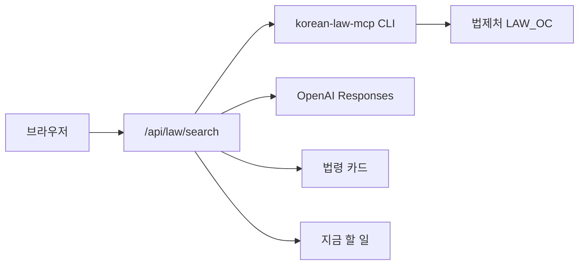

<p align="center">
  <strong style="font-size:1.75rem;">⚖️ 로맵 (LawMap)</strong>
</p>

<p align="center">
  복잡한 법령, <strong>내 상황</strong>만 적으면 관련 조문과 실무 안내를 정리해 드립니다.
</p>

<p align="center">
  <a href="https://github.com/gyu-bin/lawmap">GitHub</a>
  ·
  법령 데이터: <a href="https://github.com/chrisryugj/korean-law-mcp">korean-law-mcp</a> (법제처 Open API)
  ·
  실무 안내: OpenAI Responses API
</p>

---

## 소개

로맵은 **생활 속 법률 상황**(해고, 임금, 물벼락, 야근 등)을 문장으로 입력하면:

1. **법령 카드** — 법제처 API에서 조회한 **조문 원문 요약** (AI가 조문을 지어내지 않음)
2. **지금 할 일** — 조회된 조문·상황을 바탕으로 OpenAI가 생성한 **실무 행동 안내** (법률 자문 아님)

을 한 화면에 보여 주는 웹 서비스입니다.

## 주요 기능

| 기능 | 설명 |
|------|------|
| 상황 검색 | 자연어로 상황 입력 → 관련 법령·조문 카드 |
| 법제처 연동 | `korean-law-mcp` CLI로 `search_law` → `get_law_text` |
| 지금 할 일 | OpenAI `gpt-5.4-mini` (Responses API, `store: true`) |
| 상황 라우팅 | 물벼락·야근 등 일부 상황은 조회할 조문 경로만 고정 |

## 아키텍처



## 빠른 시작 (로컬)

```bash
git clone https://github.com/gyu-bin/lawmap.git
cd lawmap
npm install
cp .env.example .env
# .env 에 LAW_OC, OPENAI_API_KEY 입력
npm run dev
```

브라우저에서 **http://localhost:3000** 을 엽니다.

### 환경 변수 (로컬 `.env`)

| 변수 | 필수 | 설명 |
|------|:----:|------|
| `LAW_OC` | ✅ | [법제처 Open API](https://open.law.go.kr) 인증키 — 조문 조회 |
| `OPENAI_API_KEY` | ✅* | [OpenAI API 키](https://platform.openai.com/api-keys) — 「지금 할 일」 생성 |
| `OPENAI_MODEL` | | 기본값 `gpt-5.4-mini` |
| `PORT` | | 기본값 `3000` |

\* 없으면 「지금 할 일」은 기본 문구로 대체됩니다.

## Vercel 배포

### 1. 저장소 연결

[Vercel Dashboard](https://vercel.com/new) → **Import Git Repository** → `gyu-bin/lawmap` 선택.

또는 CLI:

```bash
npx vercel link
npx vercel --prod
```

### 2. Vercel 환경 변수 (필수)

프로젝트 **Settings → Environment Variables** 에 아래를 추가하세요.  
**Production · Preview · Development** 모두에 넣는 것을 권장합니다.

| 이름 | 값 | 용도 |
|------|-----|------|
| `LAW_OC` | `발급받은 법제처 OC 키` | korean-law CLI → 법제처 API |
| `OPENAI_API_KEY` | `sk-...` | 「지금 할 일」 OpenAI Responses |
| `OPENAI_MODEL` | `gpt-5.4-mini` | (선택) 모델 지정 |

CLI로 추가 예시:

```bash
vercel env add LAW_OC
vercel env add OPENAI_API_KEY
vercel env add OPENAI_MODEL
```

환경 변수 변경 후 **Redeploy** 가 필요합니다.

### 3. Vercel 참고 사항

- 서버리스 **최대 실행 시간**은 `vercel.json`에서 60초로 설정되어 있습니다. (플랜에 따라 상한이 다를 수 있음)
- `korean-law-mcp`는 `package.json` 의존성으로 설치되며, Vercel 빌드 시 `node_modules/.bin/korean-law` 를 사용합니다.
- **비밀키는 Vercel에만** 넣고, GitHub에는 `.env` 를 올리지 마세요.

## 프로젝트 구조

```
lawmap/
├── server.js              # Express + /api/law/search
├── lib/
│   ├── situation-playbooks.js   # 상황 → 조회할 조문 경로
│   ├── generate-next-action.js  # OpenAI 지금 할 일
│   └── parse-korean-law.js
├── index.html / index.js / index.css
├── law-api.js
└── vercel.json
```

## Cursor MCP (개발용)

에이전트에서 법령을 직접 조회할 때는 [`.cursor/mcp.json`](.cursor/mcp.json) 의 remote `korean-law` MCP를 사용할 수 있습니다.

자세한 설정: [docs/korean-law-setup-lawmap.md](docs/korean-law-setup-lawmap.md)

## 면책

본 서비스는 **법률 자문이 아닌 정보 제공**입니다. 중요한 사안은 변호사·공적 상담 기관(법률구조 132, 고용노동 1350 등)에 문의하세요.

## 라이선스

Private / All rights reserved — 저장소 소유자 정책을 따릅니다.
